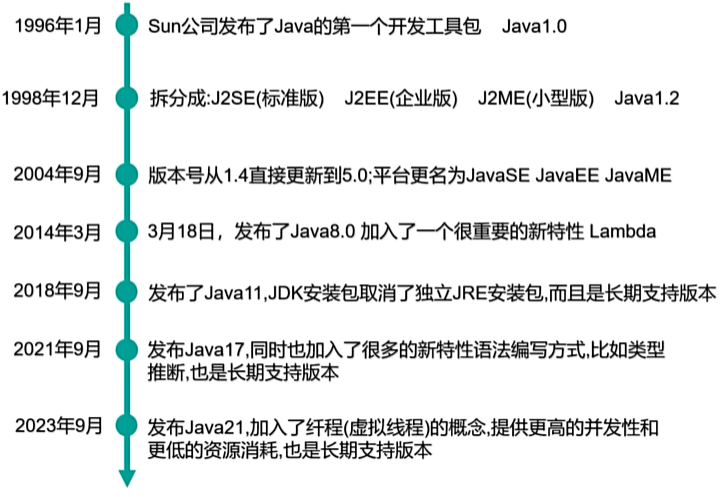

# Java概述

## JavaSE体系

- 第一部分：计算机编程核心语法
	- 数据类型，运算符，流程控制，数组，方法
- 第二部分：面向对象核心逻辑
	- 类和对象，封装，继承，多态，抽象，接口
- 第三部分：JavaSE核心高级应用
	- API，集合，IO流，多线程，网络编程，反射
- 第四部分：Java新特性
	- Lambda表达式，函数式接口，新日期类，jdk8-17新特性
## 软件和硬件

### 硬件

概念：硬件是看得见、摸得着的物理部件或者设备。在研制硬件产品时，人的创造性活动表现在把原材料转变成为有形的物理产品。
### 软件

概念：软件产品是以程序和文档的形式存在，通过在计算机上运行来体现他的作用。
## Java语言

计算机编程语言：人们对计算机下达的命令，让计算机完成人们需要的功能。

计算机语言的发展
- 第一代：机器语言
- 第二代：汇编语言
- 第三代：高级语言

### Java生态圈

作为一个平台，Java虚拟机扮演着举足轻重的作用。除了Java语言，任何一种能够被编译成字节码的计算机语言都属于Java这个平台。Groovy、Scala、JRuby、Kotlin等都是Java平台的一部分，它们依赖于Java虚拟机，同时，Java平台也因为它们变得更加丰富多彩。而且Java还可以跨平台。

作为一种文化，Java几乎成为了“开源”的代名词。在Java程序中，有着数不清的开源软件和框架。如Tomcat，Struts，Hibernate，Spring，MyBatis等。就连JDK和JVM自身也有不少开源的实现，如OpenJDK，Apache Harmony。可以说，“共享”的精神在Java世界里体现的淋漓尽致。

作为一个社区，Java拥有全世界最多的技术拥护者和开源社区支持，有数不清的论坛和资料。从桌面应用软件、嵌入式开发到企业级应用、后台服务器、中间件，都可以看到Java的身影。其应用形式之复杂、参与人数之众多也令人乍舌。可以说，Java社区已经俨然成为了一个良好而庞大的生态系统。其实这才是Java最大的优势和财富。

每个领域都是适合的编程语言，而Java是服务器端开发最适合的语言，其他编程语言也有最适合自己的领域。
### Java发展史

Java诞生于**SUN（Stanford University Network），09年**SUN被**Oracle（甲骨文）收购**。

Java之父是**詹姆斯·高斯林（James Gosling）**。

**JavaSE（Java Platform,Standard Edition 标准版）**：允许您在桌面和服务器上开发和部署Java应用程序。

**JavaEE（Java Platform,Enterprise Edition 企业版）**：是为开发企业环境下的应用程序提供的一套解决方案，主要针对于Web应用程序开发。

**JavaME（Java Platform,Micro Edition 小型版）**：为互联网上的嵌入式和移动设备上运行的应用提供了一个健壮、灵活的环境：微控制器、传感器、网关、移动电话、个人数字助理（PDA）、电视机顶盒、打印机等等。