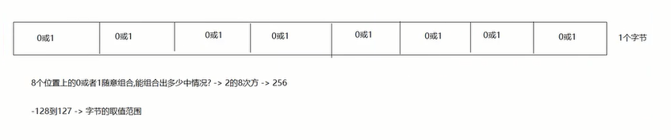

# Java概述

## JavaSE体系

- 第一部分：计算机编程核心语法
	- 数据类型，运算符，流程控制，数组，方法
- 第二部分：面向对象核心逻辑
	- 类和对象，封装，继承，多态，抽象，接口
- 第三部分：JavaSE核心高级应用
	- API，集合，IO流，多线程，网络编程，反射
- 第四部分：Java新特性
	- Lambda表达式，函数式接口，新日期类，jdk8-17新特性
## 软件和硬件

### 硬件

概念：硬件是看得见、摸得着的物理部件或者设备。在研制硬件产品时，人的创造性活动表现在把原材料转变成为有形的物理产品。
### 软件

概念：软件产品是以程序和文档的形式存在，通过在计算机上运行来体现他的作用。
## Java语言

计算机编程语言：人们对计算机下达的命令，让计算机完成人们需要的功能。

计算机语言的发展
- 第一代：机器语言
- 第二代：汇编语言
- 第三代：高级语言

### Java生态圈

作为一个平台，Java虚拟机扮演着举足轻重的作用。除了Java语言，任何一种能够被编译成字节码的计算机语言都属于Java这个平台。Groovy、Scala、JRuby、Kotlin等都是Java平台的一部分，它们依赖于Java虚拟机，同时，Java平台也因为它们变得更加丰富多彩。而且Java还可以跨平台。

作为一种文化，Java几乎成为了“开源”的代名词。在Java程序中，有着数不清的开源软件和框架。如Tomcat，Struts，Hibernate，Spring，MyBatis等。就连JDK和JVM自身也有不少开源的实现，如OpenJDK，Apache Harmony。可以说，“共享”的精神在Java世界里体现的淋漓尽致。

作为一个社区，Java拥有全世界最多的技术拥护者和开源社区支持，有数不清的论坛和资料。从桌面应用软件、嵌入式开发到企业级应用、后台服务器、中间件，都可以看到Java的身影。其应用形式之复杂、参与人数之众多也令人乍舌。可以说，Java社区已经俨然成为了一个良好而庞大的生态系统。其实这才是Java最大的优势和财富。

每个领域都是适合的编程语言，而Java是服务器端开发最适合的语言，其他编程语言也有最适合自己的领域。
### Java发展史

Java诞生于**SUN（Stanford University Network），09年**SUN被**Oracle（甲骨文）收购**。

Java之父是**詹姆斯·高斯林（James Gosling）**。


**JavaSE（Java Platform,Standard Edition 标准版）**：允许您在桌面和服务器上开发和部署Java应用程序。

**JavaEE（Java Platform,Enterprise Edition 企业版）**：是为开发企业环境下的应用程序提供的一套解决方案，主要针对于Web应用程序开发。

**JavaME（Java Platform,Micro Edition 小型版）**：为互联网上的嵌入式和移动设备上运行的应用提供了一个健壮、灵活的环境：微控制器、传感器、网关、移动电话、个人数字助理（PDA）、电视机顶盒、打印机等等。
## 什么是软件开发

软件开发是根据用户要求建造出软件系统或者系统中的软件部分的过程。

软件开发是一项包括**需求捕捉、需求分析、设计、实现和测试**的系统工程。

软件一般是用某种程序设计语言来实现的。通常采用软件开发工具可以进行开发。
# Java入门前言

## 字节

字节：计算机中存储数据的最小计量单位，用`byte`或者`B`表示。

计算机中最小的存储单元是二进制，因为计算机上任何能看到的东西都是由CPU通过二进制转来的，二进制用`bit`表示。

**8个二进制代表一个字节**

存储数据的计量单位换算：
- 8bit = 1B
- 1024B = 1KB
- 1024KB = 1MB
- 1024MB = 1GB
- 1024GB = 1TB
- ...


## 常用dos命令

|       作用        |                         命令                         |
| :-------------: | :------------------------------------------------: |
|      切换盘符       | 盘符名: -> 回车<br>例如：`E:`<br>盘符名不区分大小写，但是计算机上必须有指定的盘符。 |
| 查看当前路径下的文件或者文件夹 |                        dir                         |
|    进入到指定文件夹下    |                       cd 文件夹                       |
|    进入到多级文件夹下    |                     cd 文件夹\文件夹                     |
|     退到上一级目录     |                        cd..                        |
|     直接退到根目录     |                        cd\                         |
|       清屏        |                        cls                         |
|       退出        |                        exit                        |
|      创建文件夹      |                       mkdir                        |
|     创建多级文件夹     |                   mkdir 文件夹\文件夹                    |
|      删除文件夹      |              rd 文件夹<br>注意：删除的文件夹必须是空的              |
|      删除文件       |           del 文件名+后缀名<br>注意：直接删除，不进入回收站            |
|     批量删除文件      |                     del *.后缀名                      |
# Java环境

## JVM和跨平台

JVM（Java虚拟机）：java运行程序的假象计算机，主要用来运行java程序。

跨平台：java代码可以在不同的操作系统上运行。（一次编写，到处运行）

关系：Java程序想要在不同的操作系统上运行，实现跨平台，就需要安装不同版本的jvm。
## JDK和JRE

jdk（Java Development kit）：java开发工具包，包含jre。
- javac 编译工具
- java 运行工具
- jdb 调试工具
- jhat 内存分析工具
- ...

jre（Java Runtime Environment）：java运行环境，包含了jvm以及后面开发用到的核心类库。

jdk和jre以及jvm的关系：jdk包含了jre，jre包含了jvm。

但是从jdk9开始jdk目录就没有单独的jre目录了，因为jre作为一个运行时，里面不需要包含太多的东西浪费空间，降低运行效率，在jdk9的时候引用模块化的技术，让开发者能按照自己的应用创建一个最小的运行时（比如一个微服务的部署应用仅仅需要一个非常小的runtime，而不是像以前一样不管应用复杂还是简单，都需要一个近百兆的jre运行）这样提高了运行效率。
# Java第一个程序的开发

## 步骤

1. 编写：
	1. 创建一个文本文档，将后缀名改成`.java`，变成一个java文件。
	2. 注意：需要将文件的后缀名显示出来。
2. 编译：
	1. 命令：`javac java文件名.java`。
	2. 注意：javac会将java文件编译，生成一个.class文件（字节码文件），jvm运行只认class文件。
3. 运行：
	1. 命令：java `class文件名`（不需要带后缀名）。
## Hello World

```java
public class HelloWorld{
	public static void main(String[] args){
		System.out.println("Hello,World!");
	}
}
```

## 注释

### 概述

对代码的解释说明

### 分类

```java
 a.单行注释：
   // 注释内容

 b.多行注释：
   /*
    注释内容
    */

 c.文档注释：
   /**
     注释内容
   */
```
e.g.
```java
// 单行注释 class后面的名字要和java文件名一致
public class HelloWorld{
	/*
	  多行注释：
	    main是一个方法，是程序的入口，jvm运行程序要找main当入口执行程序。
	*/
	public static void main(String[] args){
		/**
		  文档注释：
		    下面的语句是输出语句。
		*/
		System.out.println("Hello,World!");
	}
}
```

### 文档注释的作用

将来我们给别人一个开发好的类，如何让别人快速对我们写的代码了解呢？

我们的文档注释中的内容可以根据 javadoc 命令生成一个文档（API文档）

别人拿到这个文档，就能快速对此类以及类中实现的功能，进行快速了解

命令：`javadoc -d 要生成的文件夹名称 -author -version 文件名.java`