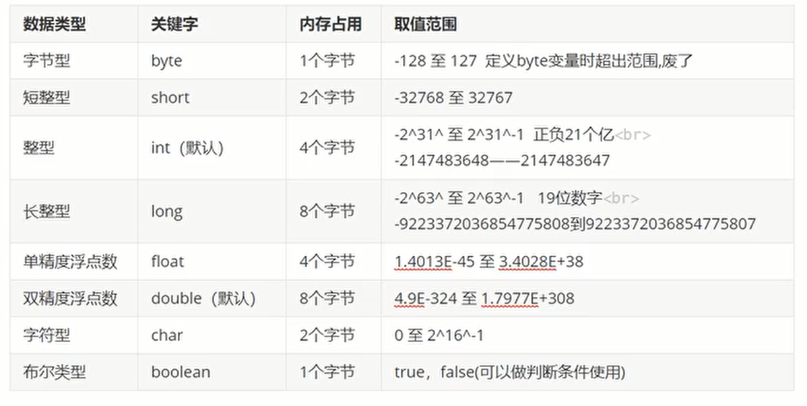

# Java概述

## JavaSE体系

- 第一部分：计算机编程核心语法
	- 数据类型，运算符，流程控制，数组，方法
- 第二部分：面向对象核心逻辑
	- 类和对象，封装，继承，多态，抽象，接口
- 第三部分：JavaSE核心高级应用
	- API，集合，IO流，多线程，网络编程，反射
- 第四部分：Java新特性
	- Lambda表达式，函数式接口，新日期类，jdk8-17新特性
## 软件和硬件

### 硬件

概念：硬件是看得见、摸得着的物理部件或者设备。在研制硬件产品时，人的创造性活动表现在把原材料转变成为有形的物理产品。
### 软件

概念：软件产品是以程序和文档的形式存在，通过在计算机上运行来体现他的作用。
## Java语言

计算机编程语言：人们对计算机下达的命令，让计算机完成人们需要的功能。

计算机语言的发展
- 第一代：机器语言；
- 第二代：汇编语言；
- 第三代：高级语言。

### Java生态圈

作为一个平台，Java虚拟机扮演着举足轻重的作用。除了Java语言，任何一种能够被编译成字节码的计算机语言都属于Java这个平台。Groovy、Scala、JRuby、Kotlin等都是Java平台的一部分，它们依赖于Java虚拟机，同时，Java平台也因为它们变得更加丰富多彩。而且Java还可以跨平台。

作为一种文化，Java几乎成为了“开源”的代名词。在Java程序中，有着数不清的开源软件和框架。如Tomcat，Struts，Hibernate，Spring，MyBatis等。就连JDK和JVM自身也有不少开源的实现，如OpenJDK，Apache Harmony。可以说，“共享”的精神在Java世界里体现的淋漓尽致。

作为一个社区，Java拥有全世界最多的技术拥护者和开源社区支持，有数不清的论坛和资料。从桌面应用软件、嵌入式开发到企业级应用、后台服务器、中间件，都可以看到Java的身影。其应用形式之复杂、参与人数之众多也令人乍舌。可以说，Java社区已经俨然成为了一个良好而庞大的生态系统。其实这才是Java最大的优势和财富。

每个领域都是适合的编程语言，而Java是服务器端开发最适合的语言，其他编程语言也有最适合自己的领域。
### Java发展史

Java诞生于**SUN（Stanford University Network），09年**SUN被**Oracle（甲骨文）收购**。

Java之父是**詹姆斯·高斯林（James Gosling）**。


**JavaSE（Java Platform,Standard Edition 标准版）**：允许您在桌面和服务器上开发和部署Java应用程序。

**JavaEE（Java Platform,Enterprise Edition 企业版）**：是为开发企业环境下的应用程序提供的一套解决方案，主要针对于Web应用程序开发。

**JavaME（Java Platform,Micro Edition 小型版）**：为互联网上的嵌入式和移动设备上运行的应用提供了一个健壮、灵活的环境：微控制器、传感器、网关、移动电话、个人数字助理（PDA）、电视机顶盒、打印机等等。
## 什么是软件开发

软件开发是根据用户要求建造出软件系统或者系统中的软件部分的过程。

软件开发是一项包括**需求捕捉、需求分析、设计、实现和测试**的系统工程。

软件一般是用某种程序设计语言来实现的。通常采用软件开发工具可以进行开发。
# Java入门前言

## 字节

字节：计算机中存储数据的最小计量单位，用`byte`或者`B`表示。

计算机中最小的存储单元是二进制，因为计算机上任何能看到的东西都是由CPU通过二进制转来的，二进制用`bit`表示。

**8个二进制代表一个字节**

存储数据的计量单位换算：
- 8bit = 1B；
- 1024B = 1KB；
- 1024KB = 1MB；
- 1024MB = 1GB；
- 1024GB = 1TB；
- ...


## 常用dos命令

|       作用        |                         命令                         |
| :-------------: | :------------------------------------------------: |
|      切换盘符       | 盘符名: -> 回车<br>例如：`E:`<br>盘符名不区分大小写，但是计算机上必须有指定的盘符。 |
| 查看当前路径下的文件或者文件夹 |                        dir                         |
|    进入到指定文件夹下    |                       cd 文件夹                       |
|    进入到多级文件夹下    |                     cd 文件夹\文件夹                     |
|     退到上一级目录     |                        cd..                        |
|     直接退到根目录     |                        cd\                         |
|       清屏        |                        cls                         |
|       退出        |                        exit                        |
|      创建文件夹      |                       mkdir                        |
|     创建多级文件夹     |                   mkdir 文件夹\文件夹                    |
|      删除文件夹      |              rd 文件夹<br>注意：删除的文件夹必须是空的              |
|      删除文件       |           del 文件名+后缀名<br>注意：直接删除，不进入回收站            |
|     批量删除文件      |                     del *.后缀名                      |
# Java环境

## JVM和跨平台

JVM（Java虚拟机）：java运行程序的假象计算机，主要用来运行java程序。

跨平台：java代码可以在不同的操作系统上运行。（一次编写，到处运行）。

关系：Java程序想要在不同的操作系统上运行，实现跨平台，就需要安装不同版本的jvm。
## JDK和JRE

jdk（Java Development kit）：java开发工具包，包含jre。
- javac 编译工具；
- java 运行工具；
- jdb 调试工具；
- jhat 内存分析工具；
- ...

jre（Java Runtime Environment）：java运行环境，包含了jvm以及后面开发用到的核心类库。

jdk和jre以及jvm的关系：jdk包含了jre，jre包含了jvm。

但是从jdk9开始jdk目录就没有单独的jre目录了，因为jre作为一个运行时，里面不需要包含太多的东西浪费空间，降低运行效率，在jdk9的时候引用模块化的技术，让开发者能按照自己的应用创建一个最小的运行时（比如一个微服务的部署应用仅仅需要一个非常小的runtime，而不是像以前一样不管应用复杂还是简单，都需要一个近百兆的jre运行）这样提高了运行效率。
# Java基础知识

## 编译步骤

1. 编写：
	1. 创建一个文本文档，将后缀名改成`.java`，变成一个java文件；
	2. 注意：需要将文件的后缀名显示出来；
2. 编译：
	1. 命令：`javac java文件名.java`；
	2. 注意：javac会将java文件编译，生成一个.class文件（字节码文件），jvm运行只认class文件；
3. 运行：命令 -> `java class文件名`（不需要带后缀名）。
## 注释

### 概述

对代码的解释说明。

### 分类

```java
 1.单行注释：
   // 注释内容

 2.多行注释：
   /*
    注释内容
    */

 3.文档注释：
   /**
     注释内容
   */
```
e.g.
```java
// 单行注释 class后面的名字要和java文件名一致
public class HelloWorld{
	/*
	  多行注释：
	    main是一个方法，是程序的入口，jvm运行程序要找main当入口执行程序。
	*/
	public static void main(String[] args){
		/**
		  文档注释：
		    下面的语句是输出语句。
		*/
		System.out.println("Hello,World!");
	}
}
```

### 文档注释的作用

快速的了解代码。

我们的文档注释中的内容可以根据 javadoc 命令生成一个文档（API文档）。

别人拿到这个文档，就能快速对此类以及类中实现的功能，进行快速了解。

**命令：**`javadoc -d 要生成的文件夹名称 -author -version 文件名.java`
## 字符编码

- 编码：保存数据的过程就是编码的过程；
- 解码：读数据的过程就是解码的过程；
- 注意：
	- 编码和解码遵守的编码规范必须是一样的；
	- 常见的两个编码规范：
		- GBK：专门为中文所设计的编码；
			- ANSI代表的是GBK；
			- 一个中文汉字在GBK中占2个字节；
		- UTF-8：一个中文汉字在UTF-8中占3个字节；
	- doc命令窗口默认编码：GBK。
## 源文件名与类名一致问题

- 类名不是必须和java文件名称一致；
	- 如果类名和java文件名不一致，需要将class前面的public去掉；
- 如果class前面带public，此时类名必须要和java文件名一致；
- 一个java文件中可以写多个class类，但是只能有一个类带public；
	- 不建议在一个java文件中写多个class -> 一个java文件中就写一个class，且带public；
- main方法必须写在带public类中。

## println和print区别

相同：都是输出语句。
不同：
- println：输出之后自带换行效果。
- print：输出之后不带换行效果。
## 常量

### 常量的定义

概述：在代码的运行过程中，值不会发生改变的数据。
### 常量的分类

- 整数常量：所有整数；
- 小数常量：所有带小数点的；
- 字符常量：带单引号的 `' '`，单引号中必须有且只能有一个内容；
- 字符串常量：带双引号的 `" "`，双引号中内容随意；
- 布尔常量：`true` `false`；
- 空常量：`null`，代表数据不存在。
## 变量

### 变量的定义

概述：在代码的运行过程中，值会随着不同的情况而随时发生改变的数据。

作用：一次接收一个数据。将来定义一个变量，接收一个值，后续可能会根据不同的情况对此值进行修改，此时可以用变量。

读法：先看等号右边，再看等号左边的 -> 将等号右边的数据赋值给等号左边的变量。

注意：字符串不属于基本数据类型，属于引用数据类型，用`String`表示。`String`是一个类。只不过字符串在定义的时候可以和基本数据类型格式一样。

### 变量的数据类型

基本的数据类型：4类8种。
- 整型：`byte short int long`；
- 浮点型：`float double`；
- 字符型：`char`；
- 布尔型：`boolean`。

引用数据类型：类 、数组、接口、枚举、注解。


#### byte

- byte 数据类型是8位、有符号的，以二进制补码表示的整数；
- 最小值是 `-128（-2^7）`；
- 最大值是 `127（2^7-1）`；
- 默认值是 0；
- byte 类型用在大型数组中节约空间，主要代替整数，因为 byte 变量占用的空间只有 int 类型的四分之一；
- 例子：byte a = 100，byte b = -50。
#### short

- short 数据类型是 16 位、有符号的以二进制补码表示的整数
- 最小值是 `-32768（-2^15）`；
- 最大值是 `32767（2^15 - 1）`；
- Short 数据类型也可以像 byte 那样节省空间。一个short变量是int型变量所占空间的二分之一；
- 默认值是 0；
- 例子：short s = 1000，short r = -20000。
#### int

- int 数据类型是32位、有符号的以二进制补码表示的整数；
- 最小值是 `-2,147,483,648（-2^31）`；
- 最大值是 `2,147,483,647（2^31 - 1）`；
- 一般地整型变量默认为 int 类型；
- 默认值是 `0 `；
- 例子：int a = 100000, int b = -200000。
#### long

- long 数据类型是 64 位、有符号的以二进制补码表示的整数；
- 最小值是 `-9,223,372,036,854,775,808（-2^63）`；
- 最大值是 `9,223,372,036,854,775,807（2^63 -1）`；
- 这种类型主要使用在需要比较大整数的系统上；
- 默认值是 `0L`；
- 例子： `long a = 100000L`，`long b = -200000L`。  
    "L"理论上不分大小写，但是若写成"l"容易与数字"1"混淆，不容易分辩。所以最好大写。
#### float

- float 数据类型是单精度、32位、符合IEEE 754标准的浮点数；
- float 在储存大型浮点数组的时候可节省内存空间；
- 默认值是 `0.0f`；
- 浮点数不能用来表示精确的值，如货币；
- 例子：float f1 = 234.5f。
#### double

- double 数据类型是双精度、64 位、符合 IEEE 754 标准的浮点数；
- 浮点数的默认类型为 double 类型；
- double类型同样不能表示精确的值，如货币；
- 默认值是 `0.0d`；
#### boolean

- boolean数据类型表示一位的信息；
- 只有两个取值：true 和 false；
- 这种类型只作为一种标志来记录 true/false 情况；
- 默认值是 `false`；
- 例子：boolean one = true。
#### char

- char 类型是一个单一的 16 位 Unicode 字符；
- 最小值是 `\u0000`（十进制等效值为 0）；
- 最大值是 `\uffff`（即为 65535）；
- char 数据类型可以储存任何字符；
- 例子：char letter = 'A';。

对于数值类型的基本类型的取值范围，我们无需强制去记忆，因为它们的值都已经以常量的形式定义在对应的包装类中了。

```java
public class PrimitiveTypeTest {  
    public static void main(String[] args) {  
        // byte  
        System.out.println("基本类型：byte 二进制位数：" + Byte.SIZE);  
        System.out.println("包装类：java.lang.Byte");  
        System.out.println("最小值：Byte.MIN_VALUE=" + Byte.MIN_VALUE);  
        System.out.println("最大值：Byte.MAX_VALUE=" + Byte.MAX_VALUE);  
        System.out.println();  
  
        // short  
        System.out.println("基本类型：short 二进制位数：" + Short.SIZE);  
        System.out.println("包装类：java.lang.Short");  
        System.out.println("最小值：Short.MIN_VALUE=" + Short.MIN_VALUE);  
        System.out.println("最大值：Short.MAX_VALUE=" + Short.MAX_VALUE);  
        System.out.println();  
  
        // int  
        System.out.println("基本类型：int 二进制位数：" + Integer.SIZE);  
        System.out.println("包装类：java.lang.Integer");  
        System.out.println("最小值：Integer.MIN_VALUE=" + Integer.MIN_VALUE);  
        System.out.println("最大值：Integer.MAX_VALUE=" + Integer.MAX_VALUE);  
        System.out.println();  
  
        // long  
        System.out.println("基本类型：long 二进制位数：" + Long.SIZE);  
        System.out.println("包装类：java.lang.Long");  
        System.out.println("最小值：Long.MIN_VALUE=" + Long.MIN_VALUE);  
        System.out.println("最大值：Long.MAX_VALUE=" + Long.MAX_VALUE);  
        System.out.println();  
  
        // float  
        System.out.println("基本类型：float 二进制位数：" + Float.SIZE);  
        System.out.println("包装类：java.lang.Float");  
        System.out.println("最小值：Float.MIN_VALUE=" + Float.MIN_VALUE);  
        System.out.println("最大值：Float.MAX_VALUE=" + Float.MAX_VALUE);  
        System.out.println();  
  
        // double  
        System.out.println("基本类型：double 二进制位数：" + Double.SIZE);  
        System.out.println("包装类：java.lang.Double");  
        System.out.println("最小值：Double.MIN_VALUE=" + Double.MIN_VALUE);  
        System.out.println("最大值：Double.MAX_VALUE=" + Double.MAX_VALUE);  
        System.out.println();  
  
        // char  
        System.out.println("基本类型：char 二进制位数：" + Character.SIZE);  
        System.out.println("包装类：java.lang.Character");  
        // 以数值形式而不是字符形式将Character.MIN_VALUE输出到控制台  
        System.out.println("最小值：Character.MIN_VALUE="  
                + (int) Character.MIN_VALUE);  
        // 以数值形式而不是字符形式将Character.MAX_VALUE输出到控制台  
        System.out.println("最大值：Character.MAX_VALUE="  
                + (int) Character.MAX_VALUE);  
    }  
}
```
### 注意

- 变量不初始化（第一次赋值）不能直接使用；
- 开发不要用float或者double直接参与运算，因为直接参与运算会有精度损失问题；
- 在同一个作用域中不能定义重名变量；
- 不同作用域中的数据尽量不要随意互相访问。
## 转义字符

| 符号     | 字符含义                 |
| ------ | -------------------- |
| \n     | 换行 (0x0a)            |
| \r     | 回车 (0x0d)            |
| \f     | 换页符(0x0c)            |
| \b     | 退格 (0x08)            |
| \0     | 空字符 (0x0)            |
| \s     | 空格 (0x20)            |
| \t     | 制表符                  |
| \"     | 双引号                  |
| \'     | 单引号                  |
| \\     | 反斜杠                  |
| \ddd   | 八进制字符 (ddd)          |
| \uxxxx | 16进制Unicode字符 (xxxx) |

## 标识符

### 概述

类，方法，变量取的名字。
### 注意

- 硬性规定（必须遵守）
	- 标识符可以包含数字，英文字母，符号；
	- 标识符不能以数字开头；
	- 标识符不能是关键字。
- 软性规定（建议遵守）
	- 类取名：遵循大驼峰式 -> 首字母大写；
	- 方法和变量取名：遵循小驼峰式 -> 从第二个单词开始往后首字母大写；
	- 见名知意。
## 数据类型转换

什么时候发生类型转换：
- 等号左右两边类型不一致
- 不同类型的数据做运算